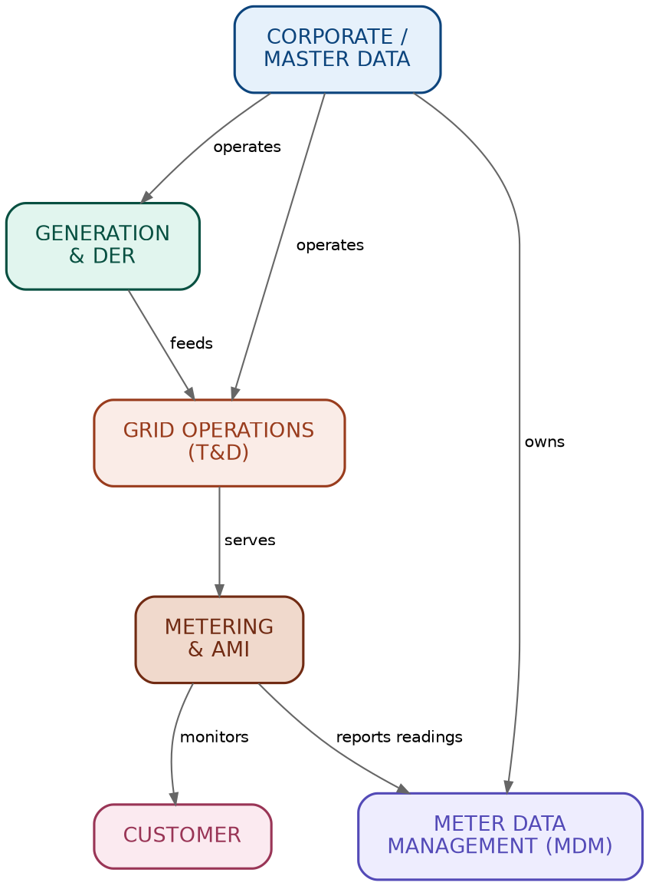
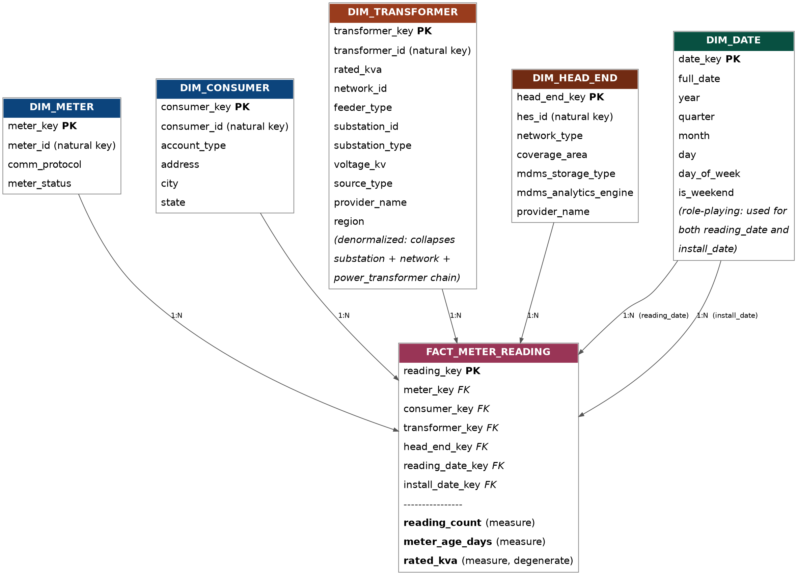
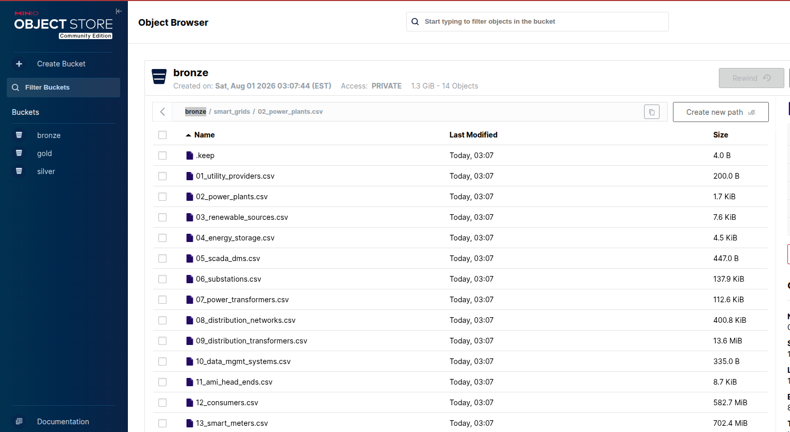

# 📊 SmartGrids Datapiple platform

> ETL data pipelines for Smart Grids and Smart Meters on local Medallion platform to provision information for data analysis and Feature Engineering.

---

## 🎯 Goal

* **Main goal:** Ingest smart grids and smart meters raw data from many csv files according to the industry to enabler semantic data.
* **Key benefit:** Allows local simulations about data pipelines under the Medallion Architecture. These data will be used for further data analysis and Feature Engineering.

---

## 🛠️ Technology Stack
 List of components, tools, languages:

* **Language:** [Python](python.og)
* **Data processing:** [PySpark](https://spark.apache.org/docs/latest/api/python/index.html)
* **Object storage:** [MinIO](https://www.min.io/)
* **Containers:** [Docker](https://docs.docker.com/compose/)

---

## 📸 Architecture Diagrams / Schemas

> * Smart Grids Modules: Organize the smart grids components under business domains

---

> * Entity Relationship:  Shows relations among all entities for the smartgrids

---

> * Smart Grids Star schema useful to optimize queries and facilitate data analysis*

---

### Data Catalog
[Reference](./docs/data_catalog.md)

---

### MinIO UI
> * Local MinIO implemented to simulate a S3 Objects Storage

---
### Jupyter Notebooks
> * Jupyter notebooks to experimentation
[Notebooks console](http://localhost:8888/lab/workspaces/auto-4/tree/notebooks/)
