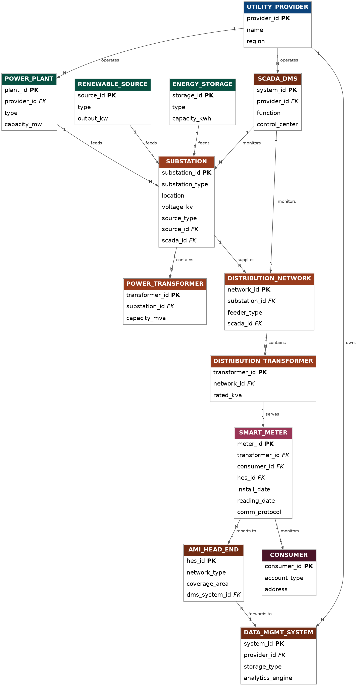

# 📊 SmartGrids Datapiple platform

> Breve descripción de una sola frase que resuma lo que hace tu proyecto (ej. "Pipeline ETL para el procesamiento y análisis de datos CSV utilizando PySpark y almacenamiento MinIO local").

---

## 🎯 Objetivo
Explica aquí el propósito principal de tu desarrollo. Qué problema resuelve, a quién ayuda y cuál es el resultado final esperado.

* **Main goal:** Ingest smart grids and smart meters raw data from many csv files according to the industry to enabler semantic data.
* **Key benefit:** Allows local simulations about data pipelines under the Medallion Architecture. These data will be used for further data analysis and Feature Engineering.

---

## 🛠️ Stack Tecnológico
Lista de las tecnologías, herramientas y librerías clave utilizadas en el proyecto:

* **Language:** 
* **Data processing:** 
* **Object storage:** 
* **Containers:** 

---

## 📸 Capturas de Pantalla / Arquitectura
Para insertar imágenes en tu documentación, guarda los archivos visuales en una carpeta llamada `docs/` o `images/` dentro de tu repositorio y enlázalos así:

### Data diagrams

*Descripción corta del flujo: Los archivos CSV ingresan a MinIO y son transformados por el clúster local de PySpark.*

### Consola de MinIO con Datos Cargados

